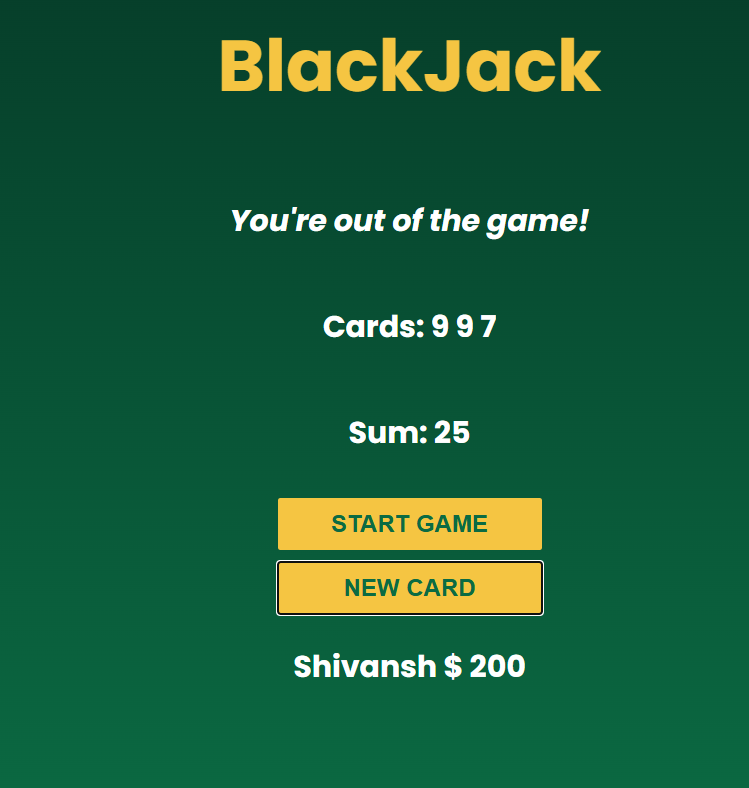

# Blackjack Game

A simple Blackjack game built using HTML, CSS, and JavaScript.

## Live Demo

[Play Blackjack](YOUR-LIVE-LINK-HERE)

## Screenshot

## Built With

* HTML
* CSS
* JavaScript

## Features

* Random card generation
* Calculate card sum
* Blackjack detection
* Draw a new card
* Game status messages

## Learning

Built while learning JavaScript and practicing functions, arrays, objects, DOM manipulation, and game logic.
